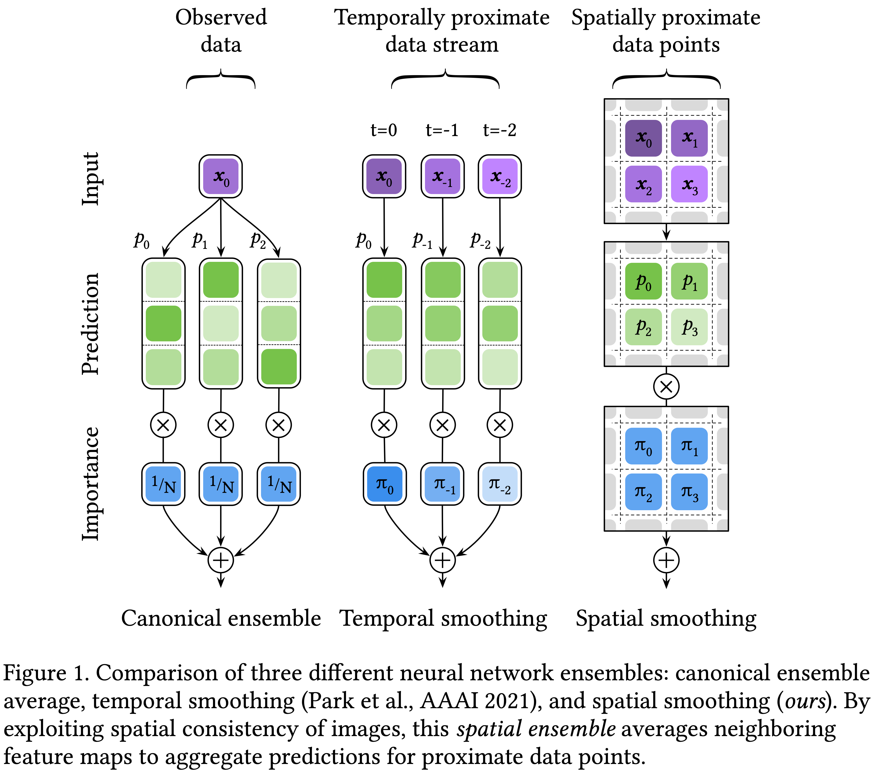
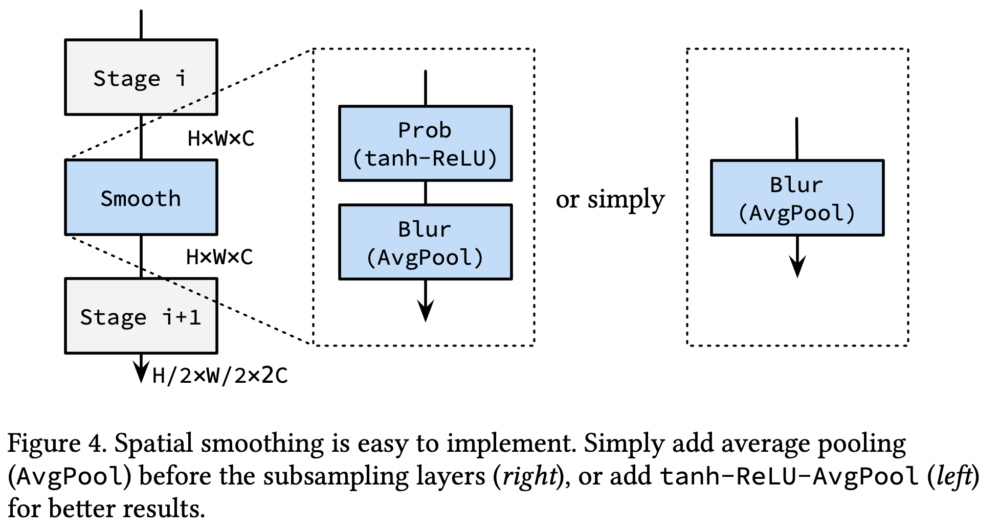
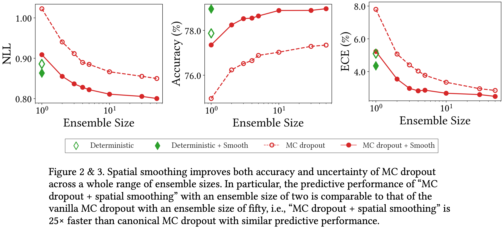
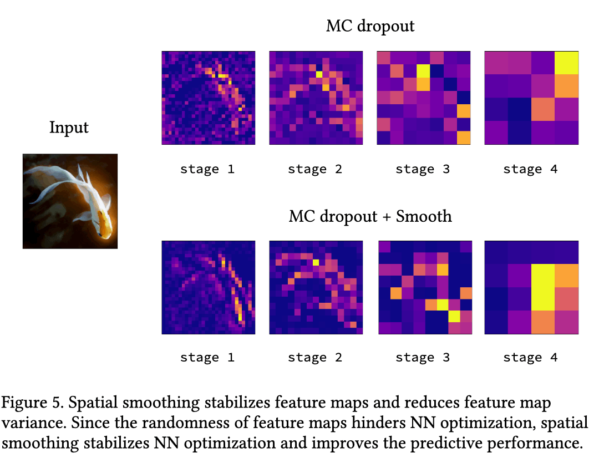
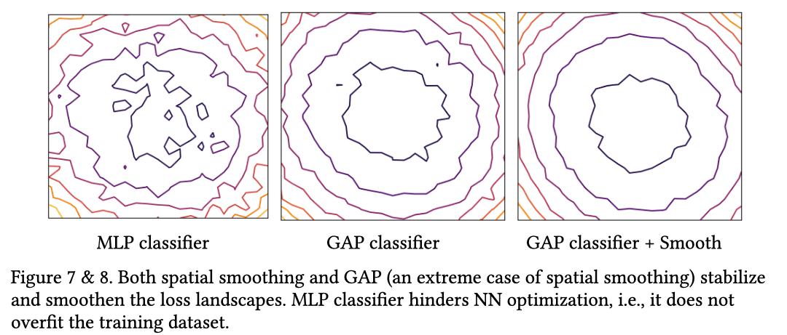
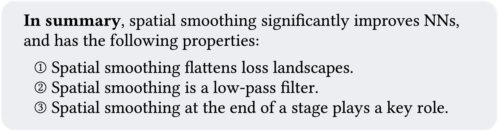
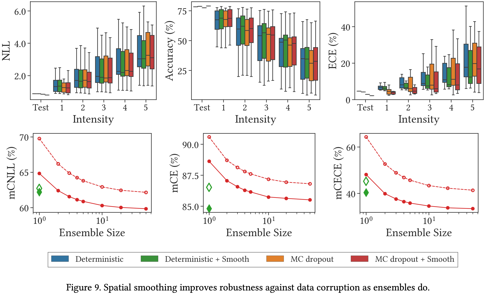

# Blurs Behaves Like Ensembles: Spatial Smoothings to Improve Accuracy, Uncertainty, and Robustness

[[arxiv](https://arxiv.org/abs/2105.12639), [poster](https://github.com/xxxnell/spatial-smoothing-storage/blob/master/resources/blurs_behave_like_ensembles_poster_icml2022.pdf)]

This repository provides a PyTorch implementation of ["Blurs Behave Like Ensembles: Spatial Smoothings to Improve Accuracy, Uncertainty, and Robustness (ICML 2022)"](https://arxiv.org/abs/2105.12639). In this work, we introduce a novel ensemble method, ***"spatial ensemble"***. Spatial ensemble, or spatial smoothing, is an extremely easy-to-implement method and can enjoy the advantages of ensemble without increasing inference time.


### I. What Is a Spatial Ensemble?

<p align="center">

</p>

*Left*: *Canonical ensemble* averages multiple NN predictions for one observed data point. Therefore, using N neural networks in the ensemble would requires N times more computational complexity than one NN execution. 

*Middle*: *Temporal smoothing* (["Vector Quantized Bayesian Neural Network Inference for Data Streams (AAAI 2021)"](https://arxiv.org/abs/1907.05911), [code and summary](https://github.com/xxxnell/temporal-smoothing) :octocat:) executes NN for "the most recent data point'' only once, and complements the result with previously calculated predictions for "other proximate data points (i.e., previous data points)" by exploiting temporal consistency. It may be a promising approach to obtain reliable results efficiently, but it was only applicable to data streams such as video sequences. 

*Right*: By exploiting the spatial consistency of images, ***we propose spatial smoothing as a method of aggregating nearby feature maps***; this spatial smoothing averages and ensembles neighboring feature map points. As a result, it simultaneously improves accuracy, uncertainty, and robustness as ensembles do. 


### II. How Can We Apply Spatial Smoothing to Our Models?

Simply add `AvgPool` with kernel size of 1 and stride of 1 `nn.AvgPool2d(kernel_size=2, stride=1, padding=1)` before the subsampling layers. For example, use four spatial smoothing layers for [ResNet](models/resnet.py). It's super easy, isn't it? 

<p align="center">

</p>

Strictly speaking, spatial smoothing consists of three simple components: `t * tanh(· / t) – ReLU – AvgPool` where `t` is a hyperparameter and this value defaults to 10. Here, `AvgPool` has a kernel size of 2 and a stride of 1 as mentioned above, so it is [a box blur](https://en.wikipedia.org/wiki/Box_blur). See the [TanhBlurBlock](models/smoothing_block.py). The module is added before each subsampling layer. However, since most CNN stages end with `ReLU`, it can be omited from the spatial smoothing layer. Likewise, `tanh` can also be omitted at the expense of some predictive performance. 

Above all things, use Global Average Pooling (instead of MLP, global max pooling, or even CLS token) for classification tasks. Global Average Pooling is the most extreme and powerful spatial ensemble. In fact, **MLP for classification does not overfit the training dataset** and **Global Average Pooling does not regularize NNs** (please refer to Table 1 in the paper).


### III. Spatial Smoothing Significantly Improves MC Dropout

One of the major advantages of spatial smoothing is that it significantly improves the performance of MC dropout. MC dropout is a popular method for approximating Bayesian neural nets. However, it is too slow to achieve high predictive performance. Our spatial smoothing address this problem as shown below.

<p align="center">

</p>

The figure above shows the predictive performance of ResNet-18 on CIFAR-100. In this figure, MC dropout requires an ensemble size of fifty to achieve high predictive performance, which results in a fiftyfold increase in computational cost. The predictive performance of "MC dropout + spatial smoothing" with an ensemble size of two is comparable to that of the vanilla MC dropout with an ensemble size of fifty. In other words, ***"MC dropout + spatial smoothing" is 25× faster than canonical MC dropout*** with similar predictive performance. Moreover, spatial smoothing also can be applied to canonical deterministic NNs to improve the performances. It consistently improves the predictive performance on ImageNet (+1.0%p in terms of accuracy).


### IV. How Does Spatial Smoothing Improve Neural Nets?

A number of evidences suggest that the improvements can be attributed to *(i) the stabilized feature maps* and *(ii) the smoothing of the loss landscape*. 

<p align="center">

</p>

To demonstrate spatial smoothing stabilizes feature maps, an example representations of ResNet-50 with MC dropout randomness are provided above. This figure shows the 2× downsampled feature maps for each stage of vanilla MC dropout and MC dropout with spatial smoothing. They are the input volumes of the next stage since ResNet starts the stage by reducing the spatial dimension. In this example, the feature maps vary due to randomness from MC dropout. Spatial smoothing results in better performance by reducing the randomness and stabilizing the feature maps at every stage. 

<p align="center">

</p>

Spatial smoothing also helps NN optimization by smoothing loss landscapes. The figure above shows the loss landscapes of ResNet-18 with MC dropout on CIFAR-100. These loss landscapes fluctuate due to the randomness of MC dropout. 

The *left* of the figure is the loss landscape of the model using MLP classifier instead of GAP classifier. The loss landscape is chaotic and irregular, resulting in hindering and destabilizing NN optimization. 

The *middle* of the figure is loss landscape of ResNet with GAP classifier. Since GAP ensembles all of the feature map points—yes, GAP is an extreme case of spatial smoothing—it flattens and stabilizes the loss landscape. 

Likewise, as shown in the *right* of the figure, spatial smoothing also flattens and stabilizes the loss landscape. Accordingly, the predictive performance of GAP classifier with spatial smoothing is the best, and that of MLP classifier is the worst. In conclusion, **averaging feature map points tends to help neural network optimization by smoothing, flattening, and stabilizing the loss landscape.** 


### V. How Can We Make Spatial Smoothing Trainable?

In summary, spatial smoothing significantly improves neural nets, and has the following properties:

<p align="center">

</p>

How can we make spatial smoothing trainable to further improve performance? We would like to point out that ***self-attentions for computer vision, also known as Vision Transformers (ViTs), can be deemed as trainable importance-weighted ensembles of feature maps***. Based on this insight, ["How Do Vision Transformers Work? (ICLR 2022 Spotlight)"](https://arxiv.org/abs/2202.06709) ([code and summary](https://github.com/xxxnell/how-do-vits-work) :octocat:) demonstrates that self-attentions have the properties of spatial smoothing; they also helps NN optimization by stabilizing feature maps and flattening loss landscapes. These suggest that self-attentions are not simply generalized Conv, but rather generalized (trainable) spatial smoothing that complement Conv. Please check it out!


## Getting Started 

The following packages are required:

* pytorch==1.6.0
* matplotlib==3.1.1
* notebook==5.7.10
* ipywidgets==7.5.1 
* timm
* tensorboard
* seaborn (optional)

We mainly use docker images `pytorch/pytorch:1.6.0-cuda10.1-cudnn7-runtime` and `pytorch/pytorch:1.7.0-cuda11.0-cudnn8-runtime` for the code. 

See ```classification.ipynb``` for image classification. Run all cells to train and test models on CIFAR-10, CIFAR-100, and ImageNet. 

**Metrics.** We provide several metrics for measuring accuracy and uncertainty: Acuracy (Acc, ↑) and Acc for 90% certain results (Acc-90, ↑), negative log-likelihood (NLL, ↓), Expected Calibration Error (ECE, ↓), Intersection-over-Union (IoU, ↑) and IoU for certain results (IoU-90, ↑), Unconfidence (Unc-90, ↑), and Frequency for certain results (Freq-90, ↑). We also define a method to plot a reliability diagram for visualization.

**Models.** We provide AlexNet, VGG, pre-activation VGG, ResNet, pre-activation ResNet, ResNeXt, WideResNet by default. Bayesian NNs contains MC dropout layers. 

<p align="center">

</p>

The figure above shows the predictive performance on CIFAR-100 meaning that spatial smoothing improves accuracy as well as uncertainty.

In addition, it is easy to use deep ensemble as follows:

``` python
import models
import models.ensemble as ensemble

model_list = []
for uid in uids:  # trained models are required
    model = models.get_model(name="resnet_dnn_18", num_classes=100, stem=False)
    models.load(model, dataset_name="cifar_100", uid=uid)
    model_list.append(model)
model = ensemble.Ensemble(model_list)
```


## Visualizing the Loss Landscapes

Refer to ```losslandscape.ipynb``` for exploring the loss landscapes. It requires a trained model. Run all cells to get predictive performance of the model for weight space grid. We provide [a sample loss landscape result](resources/results/cifar100_resnet_mcdo_18_x10_losslandscape.csv).


## Evaluating Robustness on Corrupted Datasets

Refer to ```robustness.ipynb``` for evaluation corruption robustness on [corrupted datasets](https://github.com/hendrycks/robustness) such as CIFAR-10-C and CIFAR-100-C. It requires a trained model. Run all cells to get predictive performance of the model on datasets which consist of data corrupted by 15 different types with 5 levels of intensity each. We provide [a sample robustness result](resources/results/imagenet_alexnet_dnn_corrupted.csv).

<p align="center">

</p>

The figure above shows predictive performance of ResNet-18 on CIFAR-100-C. This figure indicates that spatial smoothing improves the robustness against data corruption. Moreover, it undoubtedly helps in predicting reliable uncertainty.


## Citation

If you find this useful, please consider citing 📑 the paper and starring 🌟 this repository. Please do not hesitate to contact Namuk Park (email: namuk.park at gmail dot com, twitter: [xxxnell](https://twitter.com/xxxnell)) with any comments or feedback.

```
@inproceedings{park2022blurs,
  title={Blurs Behave Like Ensembles: Spatial Smoothings to Improve Accuracy, Uncertainty, and Robustness},
  author={Park, Namuk and Kim, Songkuk},
  booktitle={International Conference on Machine Learning},
  year={2022}
}
```


## License

All code is available to you under Apache License 2.0. Models build off the torchvision models which are BSD licensed.

Copyright the maintainers.


