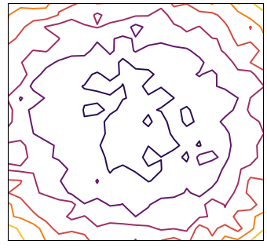
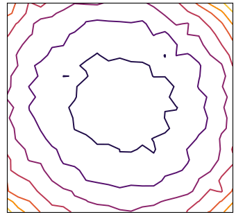
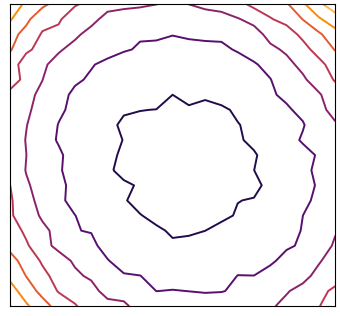

# Blurs Make Results Clearer: Spatial Smoothings to Improve Accuracy, Uncertainty, and Robustness

This repository provides a PyTorch implementation of "Blurs Make Results Clearer: Spatial Smoothings to Improve Accuracy, Uncertainty, and Robustness". In this work, we show that a simple blur operation improves accuracy, uncertainty estimation, and corruption robustness simultaneously, since the blur ensembles spatial information. In particular, **MC dropout incorporating spatial smoothing achieves high predictive performance merely with a handful of ensembles.**

<p align="center">

</p>

To help you understand spatial smoothing, we would like to provide an example of ResNet-50 as above. This figure shows the 2× downsampled feature maps for each stage of vanilla MC dropout and MC dropout with spatial smoothing. They are the input volumes of the next stage since ResNet starts the stage by reducing the spatial dimension. In this example, the feature maps vary due to randomness from MC dropout. spatial smoothing results in better performance by reducing the randomness and stabilizing the feature maps at every stage. Please refer to the figure 5 in the paper for the quantitative comparison.

<table cellspacing="15" style="width:100%;">
  <tr>
    <td></td>
    <td></td>
    <td></td>
  </tr>
  <tr>
    <td colspan="3"></td>
  </tr>
</table>

The figure above shows the predictive performance of ResNet-18 on CIFAR-100. In this figure, MC dropout requires an ensemble size of fifty to achieve high predictive performance. The predictive performance of "MC dropout + spatial smoothing" with an ensemble size of two is comparable to that of the vanilla MC dropout with an ensemble size of fifty. In other words, **"MC dropout + spatial smoothing" is 25× faster than canonical MC dropout** with similar predictive performance. Moreover, spatial smoothing also can be applied to canonical deterministic NNs to improve the performances. It consistently improves the predictive performance on ImageNet. Please refer to the figure 8 in the paper.

We also address global average pooling (GAP), pre-activation, and ReLU6 as special cases of spatial smoothing. Experiments show that they improve not only accuracy but also uncertainty and robustness.


[The official implementation of "How Do Vision Transformers Work?"](https://github.com/xxxnell/how-do-vits-work) is based on this repository. The paper shows that MSA for computer vision (a.k.a. Vision Transformer) is not simply generalized Conv, but rather generalized (trainable) spatial smoothing that complements Conv. Please check it out!


## Getting Started 

The following packages are required:

* pytorch==1.6.0
* matplotlib==3.1.1
* notebook==5.7.10
* ipywidgets==7.5.1 
* timm
* tensorboard
* seaborn (optional)

We mainly use docker images `pytorch/pytorch:1.6.0-cuda10.1-cudnn7-runtime` and `pytorch/pytorch:1.7.0-cuda11.0-cudnn8-runtime` for the code. 

See ```classification.ipynb``` for image classification. Run all cells to train and test models on CIFAR-10, CIFAR-100, and ImageNet. 

**Metrics.** We provide several metrics for measuring accuracy and uncertainty: Acuracy (Acc, ↑) and Acc for 90% certain results (Acc-90, ↑), negative log-likelihood (NLL, ↓), Expected Calibration Error (ECE, ↓), Intersection-over-Union (IoU, ↑) and IoU for certain results (IoU-90, ↑), Unconfidence (Unc-90, ↑), and Frequency for certain results (Freq-90, ↑). We also define a method to plot a reliability diagram for visualization.

**Models.** We provide AlexNet, VGG, pre-activation VGG, ResNet, pre-activation ResNet, ResNeXt, WideResNet by default. Bayesian NNs contains MC dropout layers. 

<p align="center">

</p>

The figure above shows the predictive performance on CIFAR-100 meaning that spatial smoothing improves accuracy as well as uncertainty.

In addition, it is easy to use deep ensemble as follows:

``` python
import models
import models.ensemble as ensemble

model_list = []
for uid in uids:  # trained models are required
    model = models.get_model(name="resnet_dnn_18", num_classes=100, stem=False)
    models.load(model, dataset_name="cifar_100", uid=uid)
    model_list.append(model)
model = ensemble.Ensemble(model_list)
```


## Visualizing the Loss Landscapes

Refer to ```losslandscape.ipynb``` for exploring the loss landscapes. It requires a trained model. Run all cells to get predictive performance of the model for weight space grid. We provide [a sample loss landscape result](resources/results/cifar100_resnet_mcdo_18_x10_losslandscape.csv).


<table cellspacing="15" style="width:100%;">
  <tr>
    <td></td>
    <td></td>
    <td></td>
  </tr>
    <td align="center">MLP classifier</td>
    <td align="center">GAP classifier</td>
    <td align="center">GAP classifier + Smooth</td>
  <tr>
  </tr>
</table>

The figure above shows the loss landscapes of ResNet-18 with MC dropout on CIFAR-100. These loss landscapes fluctuate due to the randomness of MC dropout. Just as spatial smoothing stabilizes the feature maps, it also stabilizes the loss landscape.

The *left* of the figure is the loss landscape of the model using MLP classifier instead of GAP classifier. The loss landscape is chaotic and irregular, resulting in hindering and destabilizing NN optimization. The *middle* of the figure is loss landscape of ResNet with GAP classifier. Since GAP ensembles all of the feature map points—yes, GAP is an extreme case of spatial smoothing—it flattens and stabilizes the loss landscape. Likewise, as shown in the *right* of the figure, spatial smoothing also flattens and stabilizes the loss landscape. Accordingly, the predictive performance of GAP classifier with spatial smoothing is the best, and that of MLP classifier is the worst.

In conclusion, **averaging feature map points tends to help neural network optimization by smoothing, flattening, and stabilizing the loss landscape.** Accordingly, GAP classifier is more robust than MLP classifier. We observe the same phenomenon for deterministic NNs. 


## Evaluating Robustness on Corrupted Datasets

Refer to ```robustness.ipynb``` for evaluation corruption robustness on [corrupted datasets](https://github.com/hendrycks/robustness) such as CIFAR-10-C and CIFAR-100-C. It requires a trained model. Run all cells to get predictive performance of the model on datasets which consist of data corrupted by 15 different types with 5 levels of intensity each. We provide [a sample robustness result](resources/results/imagenet_alexnet_dnn_corrupted.csv).


<table cellspacing="15" style="width:100%;">
  <tr>
    <td></td>
    <td></td>
    <td></td>
  </tr>
  <tr>
    <td colspan="3"></td>
  </tr>
  <tr>
    <td></td>
    <td></td>
    <td></td>
  </tr>
  <tr>
    <td colspan="3"></td>
  </tr>
</table>

The figure above shows predictive performance of ResNet-18 on CIFAR-100-C. This figure indicates that spatial smoothing improves the predictive performance for corrupted data. Moreover, it undoubtedly helps in predicting reliable uncertainty.


## How to apply spatial smoothing to your own model

spatial smoothing consists of three simple components: temperature-scaled tanh which is t * tanh(· / t) ⸺ ReLU ⸺ AvgPool with kernel size of 2 and stride of 1. "t" is a hyperparameter and this value defaults to 10. See the [TanhBlurBlock](models/smoothing_block.py). The module is added before each subsampling layer. For example, see the [ResNet](models/resnet.py).

<p align="center">

</p>

Since most CNN stages end with ReLU, it can be omited from the spatial smoothing layer.

Above all things, use GAP (instead of MLP, global max pooling, or even CLS token) for classification tasks!


## Citation

If you find this useful, please consider citing 📑 the paper and starring 🌟 this repository. Please do not hesitate to contact Namuk Park (email: namuk.park at gmail dot com, twitter: [xxxnell](https://twitter.com/xxxnell)) with any comments or feedback.

```
@article{park2021blurs,
  title={Blurs Make Results Clearer: Spatial Smoothings to Improve Accuracy, Uncertainty, and Robustness},
  author={Park, Namuk and Kim, Songkuk},
  journal={arXiv preprint arXiv:2105.12639},
  year={2021}
}
```


## License

All code is available to you under Apache License 2.0. Models build off the torchvision models which are BSD licensed.

Copyright the maintainers.


